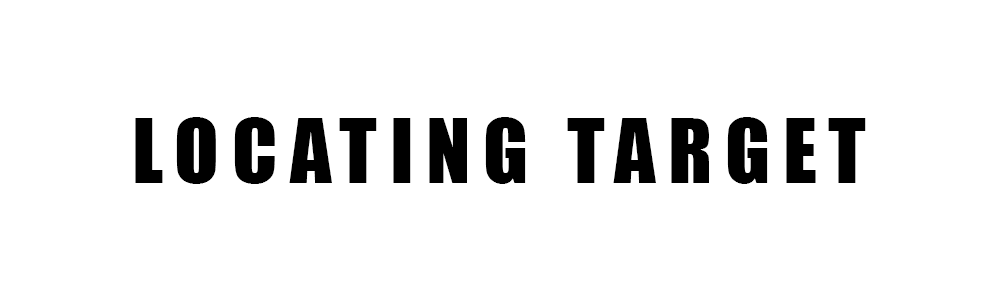
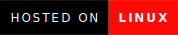

  

 
 
Nasef's Special Operation #1 (Locating Target) is a boot2root security challenge and vulnerable machine.

I wanted to create a challenge for both enteratainment and education .

**This is why I created this project**.

[Key Features](#key-features) •
[Installation](#installation) •
[Target](#target) •
[Technologies](#technologies) •
[Contact Me](#contact-me) 

<!---->

## Installation

1. Download the machine from the [following link](https://www.vulnhub.com/entry/nasef1-locating-target,640/)
2. Open the machine using vmware, and it will start running smoothly

## Target

Commander-in-chief : Hello Agent R, Two hours ago we lost contact with agent (N.A.S.E.F). He was in a secret mission in the enemy state "SOURG". Your mission is to lead the task-force and bring him to our homeland safely, But first we need to hack into SOURG's satellites to locate both user and root flag which represents nasef's coordinates. Good Luck

The mission involves hacking into SOURG's satellites to locate both the user and root flags, representing the coordinates of Agent N.A.S.E.F. The difficulty level is categorized as easy, and participants are required to download the challenge files to proceed.

Difficulty : Easy

## Technologies

| Application                                         | Description                                  
| --------------------------------------------------- |---------------------------------------------   
| [Linux](https://www.linux.org/)    | A family of open-source Unix-like operating systems based on the Linux kernel         
| [Markdown](https://www.markdownguide.org/)    | A reference guide that explains how to use markdown                                 

## Contact Me

